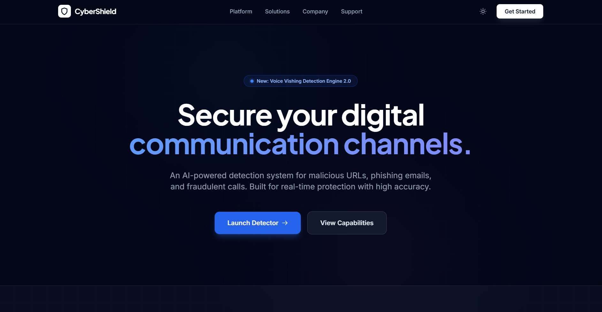
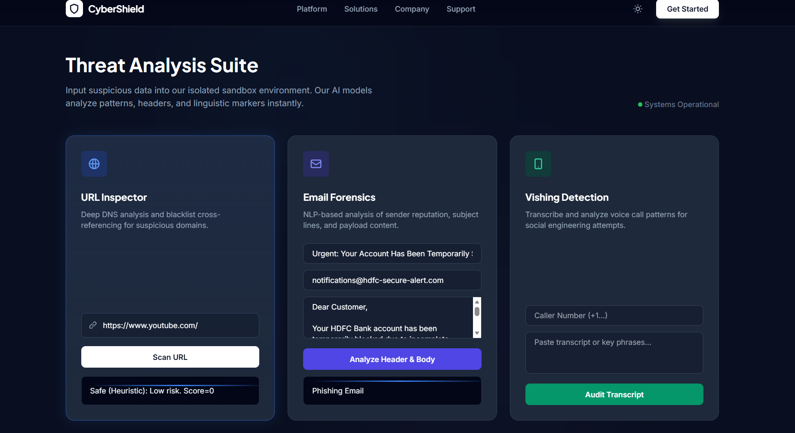

# 🛡️ CyberShield Security Suite  
### **AI-Powered Phishing Detection System (Mini Project)**  


---

##  About the Project (Mini Project)
**CyberShield Security Suite** is a cybersecurity-focused **mini project** developed for academic learning and practical implementation.  
It demonstrates how **AI + Machine Learning** can detect:

Phishing URLs  
 Phishing Emails  
 Scam Call Transcripts  

The system is built with a **production-like architecture**, making it more advanced than a typical mini project while remaining simple enough for academic evaluation.

---

##  Features

###  URL Threat Inspector
- ML-based detection (Random Forest)  
- TF-IDF + Numeric feature engineering  
- Confidence scores  
- Heuristic fallback analysis  

###  Email Forensics Analyzer
- NLP-based classification (phishing vs safe)  
- Uses subject + sender + email body  
- Trained on curated phishing datasets  

###  Vishing (Call Scam) Analyzer
- Detects psychological manipulation patterns  
- Based on transcript NLP modeling  

###  Modern Frontend
- Built using **HTML + TailwindCSS**  
- Fully responsive UI  
- Professional, infosec-themed design  

---

##  Project Screenshots

###  Homepage


###  URL Scanner


###  Email Analyzer


---

##  Tech Stack

### **Frontend**
- HTML5  
- TailwindCSS  
- JavaScript  

### **Backend**
- Python  
- Flask  

### **Machine Learning + NLP**
- Scikit-Learn  
- TF-IDF Vectorization  
- Random Forest Classifier  
- NumPy, Pandas  

---

## ⚙ How the System Works

### **1️⃣ User Input**
- URL  
- Email (subject + sender + body)  
- Call transcript  

### **2️⃣ Data Processing / NLP**
- TF-IDF vectorization  
- Text cleaning  
- Custom URL feature engineering  

### **3️⃣ ML Prediction**
Each detector runs its own trained model:
- phishing.pkl (URL model)  
- email_rf_model.pkl  
- call_rf_model.pkl  

### **4️⃣ Threat Report**
- UI displays:  
- Safe  
- Suspicious  
- Dangerous  
- Confidence Score  

---

##  Project Structure

```
CyberShield/
│── app.py
│── requirements.txt
│── .gitignore
│── LICENSE
│── static/
│   ├── mukul.jpg
│   ├── nikhil.jpg
│   └── screenshots...
│── templates/
│   └── index.html
│── Dataset/
│   ├── email_dataset.csv
│   ├── call_dataset.csv
│   └── phishing_site_urls.csv
│── train_email_model.py
│── train_call_model.py
│── train_url_model_fixed.py
│── email_rf_model.pkl
│── call_rf_model.pkl
└── phishing.pkl
```

---

##  Installation

### 1️⃣ Clone Repository
```bash
git clone https://github.com/MUKUL-TIWARI/CyberShield-Security-Suite.git
cd CyberShield-Security-Suite
```

### 2️⃣ Setup Virtual Environment
```bash
python -m venv venv
venv\Scripts\activate     # Windows
```

### 3️⃣ Install Dependencies
```bash
pip install -r requirements.txt
```

---

## ▶ Run the Project
```bash
python app.py
```

Open your browser:  
```
http://127.0.0.1:5000/
```

---

##  Why This Mini Project is Valuable  
- Combines **Cybersecurity + Machine Learning + NLP + Web Development**  
- Includes **3 fully trained ML models**  
- Demonstrates real-world techniques like  
  - URL heuristics  
  - Email metadata analysis  
  - Scam persuasion detection  
- Shows full-stack development (UI + Backend + ML)  
- Excellent for academic presentations and portfolio  

---

## Team Members (Developers)
Nikhil Singh
Linkedin: https://www.linkedin.com/in/nikhilsingh-ml
Github: https://github.com/nikhilsingh-ml

Role: Team Leader
B.Tech AI/ML Student 

 Mukul Tiwari

Role: Co-Developer
B.Tech AI/ML Student 

---

## License
MIT License — Free to use & improve.

---

#  Thank You for Exploring CyberShield!
If you like this project, feel free to ⭐ star the repo on GitHub.

